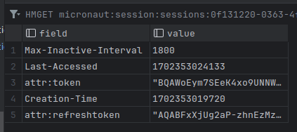

### About some ugly design choices
Session storage with redis saving tokens is really strange in this case
because it has no reason to make it not stateless and store this tokens server side, a better
implementation in this case (probably) is saving in localStorage.

I implemented like that because I didn't know how store things like tokens and sessions info
in frontend (users browser).

Anyway it was a learning experience about sessions, tokens, cookies and redis.

### Session and tokens
So I used Micronaut Session, making it stateful with redis. Every requisition has in cookies an "UUID like" string, 
this string is basic 64 coded, we decode it in the backend and get user's sessions based in the key value from it.

So, we can store sessions in this way, but you probably don't want to store JWT tokens like I did,
because make it stateful (and we use JWT because stateless characteristic) and in the most cases, we have no reason to it.

No problem with stateful. The problem is the way that I implemented, making it redundant and contradictory

Redis storing session:

### How to improve
We can just remove redis dependencies, Sessions objects from controller, and store the tokens and refresh tokens in localStorage instead of redis

### OAuth2 flux image from Micronaut

### How to use
At now, we have the /oauth/login endpoint. When you hit this endpoint you do your login and accept
user-read scope. Spotify return a callback for /callback, so we validate our code and get the tokens.

Now we just need to implement other endpoints like artists, songs, etc.